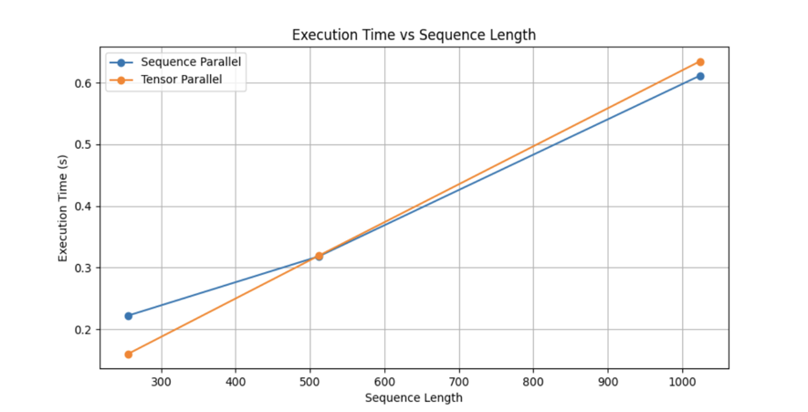
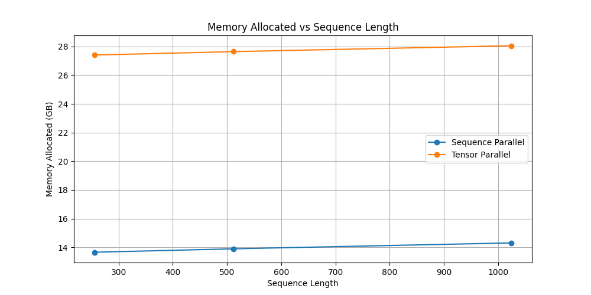
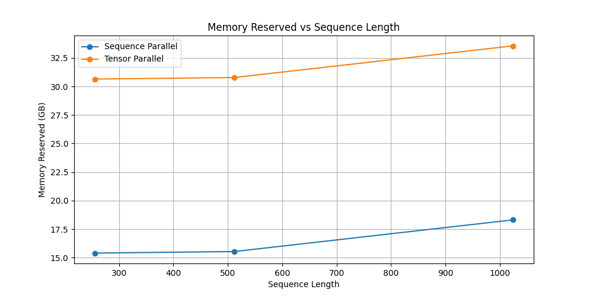
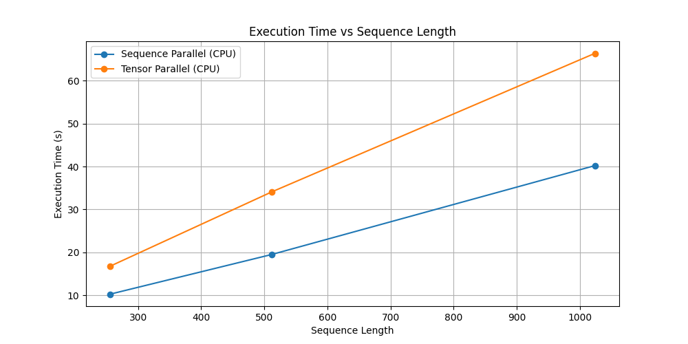
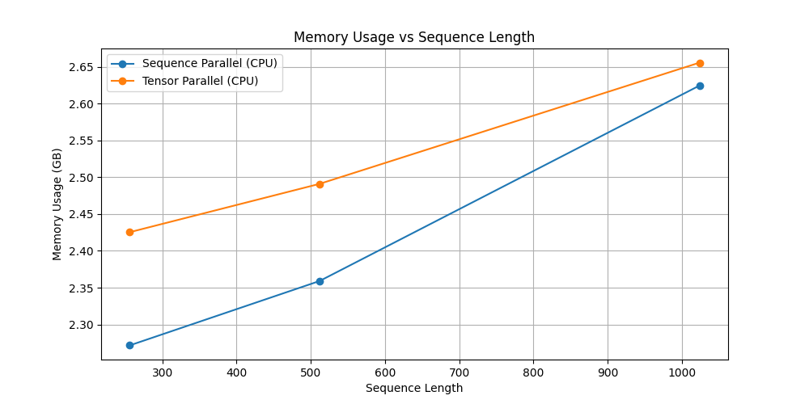

# HPML Project - Extending Tensor Parallelism for IBM FMS: Sequence Parallelism
Team: Maria Surani (ms7019), Ryan Ghosh (rg3681), Sibi Marappan (sm5726)

## Project Description
This project extends a strategy for distributed model processing by combining Sequence Parallelism (SP) with Tensor Parallelism (TP).
Our approach integrates SP into normalization layers and adjusts the input/output layouts to remain compatible with linear layers parallelized either row-wise or column-wise.

Additionally, we automated the generation of parallelization plans using regex pattern matching, replacing the manual, hardcoded layer name specification previously used.

We built two test scripts to benchmark performance using metrics such as latency and memory usage, across both CPU and GPU environments.

## Code Structure
```
/fms/distributed/strategy/
│
├── TensorParallelStrategy  class   # Now reads an ENV variable to toggle SP
├── generate_layer_plan             # Automates TP/SP plan using regex; replaces manual naming
├── _distribute_module              # Modified embedding row-wise output layout (sharded across dim=1)
├── _distribute_layer, _distribute_module       # Cleaned up repetitive logic

/tests/distributed/
│
├── test_tp_sp_cpu.py               # Gloo backend - CPU test
├── test_tp_sp_distributed_cluster.py  # Multi-GPU distributed test
├── test_tp_sp_distributed_cluster.sh  # Insomnia cluster job submission script
```

## Example Usage

To run the CPU-based test script with 2 parallel processes using sequence parallelism enabled:

```bash
cd tests/distributed
USE_SEQUENCE_PARALLELISM=true torchrun --nproc-per-node=2 test_tp_sp_cpu.py
```

### Multi-GPU Environment (Insomnia Cluster)

- Check available modules
```bash
module avail
```
- Load required module (e.g., Anaconda)
```bash
module load anaconda
```
- Submit the SLURM job script (e.g., test_tp_sp_distributed_cluster.sh)
```bash
sbatch test_tp_sp_distributed_cluster.sh
```
- Monitor job status
```bash
squeue -u <your_uni>
```
> **Note**  
> Ensure all environment dependencies from the original IBM FMS repository are properly set up beforehand.

## Results & Observations

### Model Configuration

- Model: LLaMA
- Layers: 32 on GPU, 2 on CPU
- Number of Attention Heads: 32
- Sequence Lengths Tested: 256, 512, 1024

### GPU Test Environment (L40)

- Hardware: 2× NVIDIA L40 GPUs
- GPU Memory: 48 GB per GPU
- Architecture: Ada Lovelace
- Compute Capability: 8.9
- Distributed Backend: NCCL
- SLURM Job Settings:
  - `--gres=gpu:l40:2`
  - `--ntasks=2`
  - `--cpus-per-task=24`
  - `--mem=192G`
  - `--time=00:20:00`

### GPU Benchmark Results (L40)

#### Execution Time vs Sequence Length



| Sequence Length | TP Latency (s) | SP Latency (s) |
|------------------|----------------|----------------|
| 256              | 0.14           | 0.22           |
| 512              | 0.41           | 0.42           |
| 1024             | 0.63           | 0.61           |

- Tensor Parallelism (TP) performs better at short sequence lengths due to reduced communication overhead.
- Sequence Parallelism (SP) scales more efficiently with longer sequences.

#### Memory Allocated vs Sequence Length



| Sequence Length | TP Memory (GB) | SP Memory (GB) |
|------------------|----------------|----------------|
| 256              | 27.40          | 13.66          |
| 512              | 27.64          | 13.90          |
| 1024             | 28.05          | 14.31          |



| Sequence Length | TP Memory (GB) | SP Memory (GB) |
|------------------|----------------|----------------|
| 256              | 30.65          | 15.41          |
| 512              | 30.78          | 15.54          |
| 1024             | 33.56          | 18.31          |
- SP consistently consumes less memory than TP across all tested sequence lengths.
- The difference is more noticeable at higher sequence lengths.

  ### CPU Test Environment

- Processor: Intel(R) Xeon(R) Platinum 8460Y+
- Total Physical Cores: 80
- Logical Cores (Threads): 160
- Threads per Core: 2
- NUMA Sockets: 2
- Total System RAM: 539.81 GB

### CPU Benchmark Results

#### Execution Time vs Sequence Length



| Sequence Length | TP Time (s) | SP Time (s) |
|------------------|-------------|-------------|
| 256              | 16.77       | 10.25       |
| 512              | 34.10       | 19.50       |
| 1024             | 66.40       | 40.22       |

- Sequence Parallelism (SP) significantly outperforms Tensor Parallelism (TP) in CPU settings.
- The relative performance gain increases with sequence length due to reduced synchronization overhead in SP.

#### Memory Usage vs Sequence Length



| Sequence Length | TP Memory (GB) | SP Memory (GB) |
|------------------|----------------|----------------|
| 256              | 2.43           | 2.27           |
| 512              | 2.49           | 2.36           |
| 1024             | 2.66           | 2.63           |

- Memory usage remains comparable across both approaches.
- SP consistently consumes slightly less memory across all evaluated sequence lengths.


## Weights & Biases

* [wandb.ai/team9_hpml-columbia-university](https://wandb.ai/team9_hpml-columbia-university) - All training runs, benchmarks, and SP+TP experiments are tracked on our public Weights & Biases project board:

# ORIGINAL README - IBM Foundation Model Stack

Foundation Model Stack is a collection of components for development, inference, training, and tuning of foundation models leveraging PyTorch native components. For inference optimizations we aim to support PyTorch compile, accelerated transformers, and tensor parallelism. At training time we aim to support FSDP, accelerated transformers, and PyTorch compile. To enable these optimizations, we will provide reimplementations of several popular model architectures starting with Llama and GPT-BigCode. 

## Models Supported
| Model family | Inference | Tuning and Training |
|--------------| ---------- | ------------------ |
| LLaMA        | :heavy_check_mark: | :heavy_check_mark: |
| GPT-BigCode  | :heavy_check_mark: | :x: |
| RoBERTa      | :heavy_check_mark: | :x: |


## Installation

We recommend running this on Python 3.11 and CUDA 12.1 for best performance, as the CPU overheads of the models are reduced significantly.

### Pypi

```
pip install ibm-fms
```

### Local

Requires [PyTorch >= 2.1](https://pytorch.org/get-started/locally/).

```
pip install -e .
```
or
```
python setup.py install
```


## Inference

#### Approach
Our approach for inference optimization is to use PyTorch compile, accelerated transformers, and tensor parallelism. PyTorch compile compiles the code into optimized kernels, accelerated transformers leverages `scaled_dot_product_attention` (SDPA) for accelerating attention computation while saving memory, and tensor parallelism is necessary for larger models.

To enable the Llama models to compile, we had to reimplement `RoPE` encodings without complex numbers. With this change, Llama model inference is able to leverage model compilation for latency reduction.

#### Inference latency
We measured inference latencies with 1024 token prompt and generation of 256 tokens on AWS P4de instance nodes with 8 80G A100 GPUs and report the median latency in the below table.
| Model | # GPUs | Median latency (ms) |
| ----- | ----------- | ----- |
| 7B | 1 | 14ms |
| 13B | 1 | 22ms |
| 70B | 8 | 30ms |

If you would like to reproduce the latencies, you can run the `scripts/benchmark_inference.py` and the details are described in [inference](./scripts).

For more information on reproducing the benchmarks and running some examples, see [here](scripts/README.md)

## HF Model Support

The support for HF models is provided by our HF model adapter. One can obtain similar latencies as tabulated above with HF models using our HF model adapter:

```python
from fms.models import get_model
from fms.models.hf import to_hf_api
import torch
from transformers import pipeline
# fms model
llama = get_model("llama", "13b")

# huggingface model backed by fms internals
llama_hf = to_hf_api(llama)

# compile the model -- in HF, the decoder only
llama_hf.decoder = torch.compile(llama_hf.decoder)

# generate some text -- the first time will be slow since the model needs to be compiled, but subsequent generations should be faster.
llama_generator = pipeline(task="text-generation", model=llama_hf, tokenizer=tokenizer)
llama_generator("""q: how are you? a: I am good. How about you? q: What is the weather like today? a:""")
```

A detailed example is provided [here](./notebooks/hf_adapted_inference.ipynb).

## Tuning

To fine-tune LLaMA, use the `scripts/train_causal.py` training script. Here's
an example of that command.
```
torchrun --nproc_per_node=2 \
        scripts/train_causal.py \
        --architecture=llama \
        --variant=7b \
        --tokenizer=~/models/tokenizer.model \
        --model_path=~/models/7B/ \
        --report_steps=10 \
        --checkpoint_format=meta \
        --distributed=fsdp
```
See options in the script for other ways to train and tune.

## Structure and contents of this Repository

* `fms/models/` - Pure pytorch implementations of popular model architectures, without requiring any specific common interface beyond `nn.Module`. Each model configuration is registered with `fms.models.register_model()` so that instances can be obtained through `fms.models.get_model('architecture', 'variant', '/path/to/data')`. Each model can also register sources/formats/versions of data to load (e.g. checkpoints provided by meta, HF, or trained from this repo). Users of the repo (e.g. `fms-extras`) can register their own model architectures as well.
* `fms/models/hf/` - Adapters that compose our native PyTorch FMS model architecture implementations in HF-compatible wrapper interfaces. Each FMS model implements an adapter, and adapted instances are obtained via `fms.models.hf.to_hf_api(model)`
* `fms/datasets/` - Code for loading data for pre-training and fine-tuning. Individual datasets are retrieved by `fms.datasets.get_dataset('name', tokenizer, 'optional path or other data reference')`. The expected tokenizer conforms to an `fms.utils.tokenizers.BaseTokenizer` interface.
* `fms/modules/` - Components extending `nn.Module` used in our model architecture implementations. Each Module has a corresponding `TPModule` so that modules can be sharded using a tensor-parallel distribution strategy. FMS modules should all support `torch.compile` without graph breaks.
* `fms/training/` - Pre-training and fine-tuning code.
* `fms/utils/` - Other operators useful in working with LLMs. These include a `generate()` function, `Tensor` subclasses, code for dealing with LLM checkpoints that might be saved/sharded in a variety of formats, tokenization code, and various other useful helper functions.
* `scripts/` - Various scripts for inference, benchmarking, and evaluation, as well as an entry-point for tuning/training.

## Extensions and Use Cases

This library is used by [three](https://github.com/foundation-model-stack/foundation-model-stack/network/dependents) dependent projects at IBM.

* [fms-fsdp](https://github.com/foundation-model-stack/fms-fsdp) - This repo shares training code that has been used to pretrain an fms implementation of LLaMA on IBM internal data.
* [fms-extras](https://github.com/foundation-model-stack/fms-extras) - This repo shares code for additional fms-based models trained by IBM. This repo will also be a home for other extensions, and may also include research or in-developent work intended for eventual upstreaming to fms.
* [TGIS](https://github.com/IBM/text-generation-inference) - This inference server includes support for serving fms models.

## Open Issues

* https://github.com/pytorch/pytorch/issues/107824 prevents training/finetuning from working with `torch.compile`.
* In addition, there are several open issues we are tracking to improve stability and memory footprint of inference
  
## References

* Huggingface TGI: https://github.com/huggingface/text-generation-inference
* IBM TGIS: https://github.com/IBM/text-generation-inference
* Megatron-LM: Reducing Activation Recomputation in Large Transformer Models – https://arxiv.org/abs/2205.05198
* FlexSP: Accelerating Large Language Model Training via Flexible Sequence Parallelism – https://arxiv.org/abs/2412.01523
