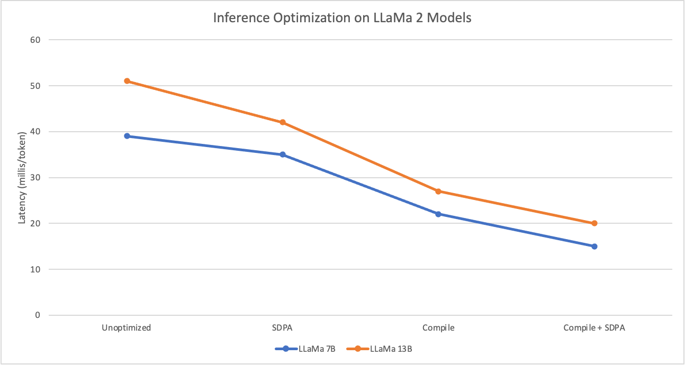

# Foundation Model Stack

Foundation Model Stack is a collection of components for development, inference, training, and tuning of foundation models leveraging PyTorch native components. For inference optimizations we aim to support PyTorch compile, accelerated transformers, and tensor parallelism. At training time we aim to support FSDP and various parallelism strategies, accelerated transformers, and PyTorch compile.

## Status
* 09/08/2023: Inference on 7B, 13B LLaMa models

## Installation

### Pypi

```
pip install ibm-fms
```

### Local

Requires [PyTorch >= 2.1](https://pytorch.org/get-started/locally/).

```
pip install -e .
```
or
```
python setup.py install
```

An example of inference on our implementation of LLaMA can be found in `scripts/inference.py`.


## Inference

Our approach for inference optimization is to use PyTorch compile, accelerated transformers, and tensor parallelism. PyTorch compile compiles the code into optimized kernels, accelerated transformers leverages `scaled_dot_product_attention` (SDPA) for accelerating attention computation while saving memory, and tensor parallelism is necessary for larger models like LLaMa 70B. In our experiments with various models `torch.compile` has given 2-2.5x speedups for inference, with `SDPA` providing 30-40% improvements.

We initially provide a re-implementation of the LLaMA2 architecture. To enable the model to compile, we reimplement `RoPE` encodings without complex numbers. We have verified that the `forward` pass compiles (there is work that needs to be done for `backward` to work with FSDP).

The figure below shows the latency improvements as we move from eager mode execution to adding SDPA, compile, and SDPA+Compile. The measurements are for 7 and 13B models.



## HF Model Support

```python
# fms model
llama: LLaMA = LLaMA(config)

# huggingface model backed by fms internals
llama_hf = LLaMAHFForCausalLM.from_fms_model(llama)

# generate some text
llama_generator = pipeline(task="text-generation", model=llama_hf, tokenizer=tokenizer)
llama_generator("""q: how are you? a: I am good. How about you? q: What is the weather like today? a:""")
```


Tensor parallel inference numbers for 13B and 70B models are **coming soon**!

## Training (Coming Soon!!)

## Open Issues
* https://github.com/pytorch/pytorch/issues/108780 requires adding graph breaks to preserve accuracy.
* https://github.com/pytorch/pytorch/issues/107824 prevents training/finetuning from working

## References

* Huggingface TGI: https://github.com/huggingface/text-generation-inference
* IBM TGIS: https://github.com/IBM/text-generation-inference
