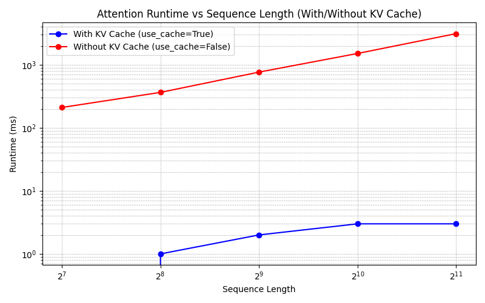
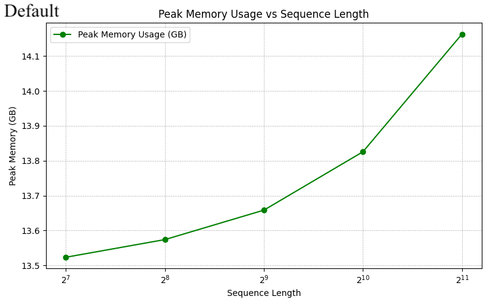
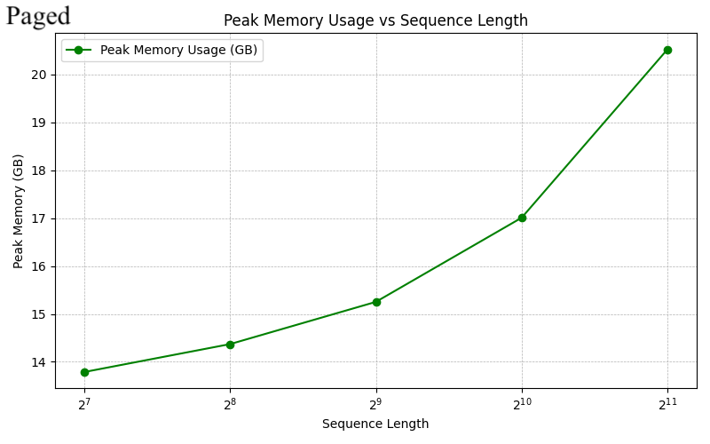

# COMS E6998 - HPML Final Project (Spring 2025) - Group 3

## Description

Our project aims to integrate PyTorch's Paged Attention into the Foundation Model Stack (FMS) using Flex Attention. We intend to enhance memory efficiency and inference speed for long-context language models without sacrificing model accuracy. Specifically, we will implement a dynamic, paged key-value (KV) cache that minimizes memory fragmentation, benchmark its performance against standard attention mechanisms, and evaluate the impact of various paging strategies on overall model performance.

## Outline of Code Repository

```text
foundation-model-stack/
├── .github/
│   └── workflows/
├── final_project/
│   ├── README.md   # This file!
│   └── report.tex  # Final project report
├── fms/
│   ├── datasets/
│   ├── models/
│   │   ├── gpt_bigcode/
│   │   ├── llama/
│   │   ├── roberta/
│   │   └── hf/
│   ├── modules/
│   │   ├── attention.py  # This is the core implementation of paged attention
│   │   └── # other files
│   ├── training/
│   └── utils/
├── notebooks/
├── scripts/
│   ├── benchmark_inference.py
│   ├── train_causal.py
│   └── # other helper & benchmark scripts
├── static/
├── tests/
│   ├── modules/
│   │   ├── test_paged_attention.py  # Unit test that we added to validate behavior of paged attention implementation
│   │   └── # other files
├── .gitignore
├── .isort.cfg
├── LICENSE
├── README.md
├── code-of-conduct.md
├── hf-requirements.txt
├── requirements.txt  # Includes using a Python wheel for installing the latest/nightly PyTorch dev build
├── test-requirements.txt
├── Makefile  # Includes all of the setup and build/test targets that we add/use in the repo
└── setup.py
```

## Example Commands

### Dev Env Setup: Ensure PyTorch 2.8+dev is installed and GPU with CUDA is available

```bash
make check-torch
```

Example output:
```bash
ndhillon@instance-20250303-021938:~/foundation-model-stack$ make check-torch
.venv/bin/python -c "import torch, sys; print(f'PyTorch version: {torch.__version__}\\nCUDA available: {torch.cuda.is_available()}'); print(f'GPU device: {torch.cuda.get_device_name(0)}' if torch.cuda.is_available() else '')"
PyTorch version: 2.8.0.dev20250503+cu126
CUDA available: True
GPU device: Tesla T4
```

### Download Llama Tokenizer (needed for Llama inference)

```bash
make download-tokenizer
```

### Run Llama Inference Benchmarks with Regular Attention

```bash
make bench-llama

# If you are using a machine with < 16GB of GPU memory, recommend running a lighter benchmark
make bench-llama-t4
```

### Run Llama Inference Benchmarks with Paged Attention

```bash
make bench-llama-paged

# If you are using a machine with < 16GB of GPU memory, recommend running a lighter benchmark
make bench-llama-paged-t4
```

### Run Paged Attention Unit Tests

```bash
make test-paged-attention
```

## Results

### Attention Runtime Benchmarks (NVIDIA L4 GPU - 24GB)




**Why KV cache makes inference so much faster**

* **What the plot shows** – For sequence lengths 128 to 2048, latency grows _slowly_ (≈ X2) when the **global KV cache** is enabled, but explodes by ~10X per doubling when it is disabled.
* **Reason** – In decoder‑only models like Llama, each new token must attend to **all prior tokens**.  
* **Without the KV cache** the model **re‑computes K and V** for every past position at every step, so work scales as **O(L²)** and GPU kernel launch overhead dominates.  
* **With the cache** those tensors are created **once** and kept in GPU memory; subsequent steps only compute Q for the new token and do a single block‑wise matmul against the cached K/V – work now scales **O(L)**.
* **Why the effect is large on an L4** – The 24 GB L4 has ample memory bandwidth (≈ 500 GB/s) but limited shader throughput compared with A100/H100. Eliminating redundant GEMMs therefore converts a compute‑bound loop into a memory‑read of already‑cached data, yielding the 100–1000X latency win seen in the blue curve.
**Take‑away:** Always enable `use_cache=True` (or paged attention) for autoregressive generation; without it you pay quadratic cost per token and quickly bottleneck even on modern GPUs.

### Peak Memory Usage Benchmarks (NVIDIA L4 GPU - 24GB)





**Why peak‐memory hardly changes**

* **Single forward pass vs. autoregressive decode** – These measurements capture just one _full‐sequence_ forward call.  Whether `use_cache=True` or `False`, the attention module **still materializes the K & V tensors for every layer** so it can compute the logits.  The only difference is that with `use_cache=True` those tensors are _retained_ for later steps, but because we run exactly one step they are freed at the end of the call.  Therefore the peak is dominated by:
  1. **Model weights** (≈ 13.4 GB in fp16 for Llama‑2‑7B)  
  2. **Layer activations / temp buffers** (≈ 0.2–1 GB)  
  3. Minor bookkeeping for the KV‑cache that never grows past one sequence

* **KV cache is tiny at batch = 1, seq ≤ 2 k** – Per layer the cache size is  

  ```
  2 × n_heads × head_dim × L × 2 bytes
  ```

  For **L = 2048** that’s ≈ 160 MB – only ~1 % of total memory – so both curves stay on top of each other until very long prompts.

* **Why the paged run rises at 4096+** – Paged attention allocates its cache in power‑of‑two blocks (128 → 256 → 512 …).  When we cross 2 k tokens it rounds up to the next block size, so we see a step‑change, but the absolute peak is still well under the L4’s 24 GB.

**Take‑away:** Peak GPU memory during _single‐step_ evaluation is governed by the model weights; KV caching only matters once you start **multi‑step generation**, where it grows linearly with the number of generated tokens.

## Wandb Project Dashboard

https://wandb.ai/nsd2147-columbia-university/hpml-final-project

Note: To setup the Eeights and Biases project run the following 
command (only needed once).

```bash
wandb init --project hpml-final-project --entity nsd2147-columbia-university
```
