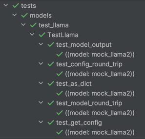

# Model Testing

In order to create your own model testing suite, fms provides a set of scripts/mixins that can be used in automating model testing.
The following are the steps to follow to add your own model testing suite:

## 1. Create a model resources for your model

### 1.1. Edit the generate_small_model_tests.py script

Edit the _generate_small_model_tests.py_ script which is used to generate a mock `model`/`config`/`signature`/`tokenizer` and store the output in `tests/resources/models/<model_name>/<model_specific_name>`.

Note: Currently there is no automated script to generate this code, but this may be addressed in the future.

This script currently has all models that are being tested in FMS. In order to create your own model, you will need to add a section as follows:

```python
############### <model_name> ###################

# scaled down version of model
<specific_model_name>_params = {
    "src_vocab_size": tokenizer.vocab_size, # we require the vocab size be based on the small tokenizer
    ...
}

if <model_name> in models or len(models) == 0:
    test_to_generate.append(
        [
            "<model_name>/<specific_model_name>",
            <model_class>, # this is the Type[nn.Module] you are testing
            <model_config>, # this is Type[ModelConfig] you are testing
            <specific_model_name>_params, # these are the params to initialize the model
            <num_params>, # params required for a single forward pass (decoder typically is 1, encoder/decoder typically is 2)
        ]
    )
```

Note: The parameters to the model are only supposed to be a scaled down version of that model, we are only trying to run through
the entire architecture, not recreate an equivalent test with the larger model

### 1.2. Run the generate_small_model_tests.py script

In order to run the _generate_small_model_tests.py_, simply open the commandline and run:

```bash
python /path/to/generate_small_model_tests.py --model=<model_name> --generate_weights --generate_config --generate_signature --generate_tokenizer 
```

This script will generate the following resources under `tests/resources/models`

```
<model_name>
| tokenizer/
| config.json
| model_state.pth
| signature.pth
```

These resources will be used directly by your model test suite and will provide useful consistency testing between versions

Note: A single model can have any number of specific models (for instance llama has llama2 and llama2 with gqa), and each folder under `tests/resources/models/<model_name>` will generate tests for that specific model.

### 1.3. Run the generate_small_model_tests.py script to patch current resources (*optional*)

If for instance, a model configuration has changed, the named parameters for the weights have changed, or a bug was found with the prior model that results in different output from prior versions,
this script may be run again with specific parameters. For instance:

--model

If not provided, will generate for all models, otherwise provide a comma separated list of model names

--generate_weights

save the model state randomly initialized

--generate_config

create a new config from the model params

--generate_signature

generate a signature for this model and save the signature

--generate_tokenizer

save the tokenizer (note: this is a small tokenizer for purposes of keeping models small for testing)

Example: a new parameter was added to the LLaMAConfig which requires an update of the config resource:

```bash
python /path/to/generate_small_model_tests.py --model=llama --generate_config 
```
## 2. Create your own model test suite

### 2.1. Add a test file

Create a test file with the name test_<model_name>.py under tests/models

### 2.2. Add a test class

Add the following code to the file, which will create a generic testing class for your model:

```python
class Test<model_name>(ModelAPITestSuite, ModelConfigTestSuite, ModelConsistencyTestSuite):
    """
    Model Test Suite for <model_name>

    This suite will include tests for:
    - model configuration
    - basic load/save model
    - consistency of model output
    """
    
    # these are abstract properties required by the above mixins
    _forward_parameters = 1
    _model_class = <model_class>
    _config_class = <config_class>

    @resource_path_fixture(test_name=<model_name>, prefix="model")
    def resource_path(self, request):
        return request.param
```

The above testing suite includes ModelAPITestSuite, ModelConfigTestSuite, ModelConsistencyTestSuite. 

ModelAPITestSuite - a test suite that provides model fixtures as well as a common set of tests that all models should be able to test for
ModelConfigTestSuite - a test suite that provides config fixtures as well as a common set of tests that all ModelConfig should be able to test for
ModelConsistencyTestSuite - a test suite that provides signature fixtures as well as a set of tests that checks output equivalency of models

Note: these are in no way the entire set of tests required, just the bare minimum set of tests and they will be expanded in the future, along with more test suite mixins

In FMS, testing utilities for Models can be included as mixins to the model testing suite in order to have the model test for these features.
If, for instance, a model does not require one of these mixins for any reason, they can be omitted for the model (though these are most likely all basic model tests a model should be able to test for)
The idea is that, we will also have other TesterMixins in the future, which may be specific to only certain types of models (i.e. GenerationTestMixin, etc.)
The mixins themselves are abstract and require certain properties of the class be set in order to run properly, this ensures that the test suite is built with all required aspects

### 3. Run the tests

In order to run the tests, simply open a commandline and run:

```bash
python /path/to/test_<model_name>.py 
```

The final suite of tests with the above configuration will produce something similar to the following:



